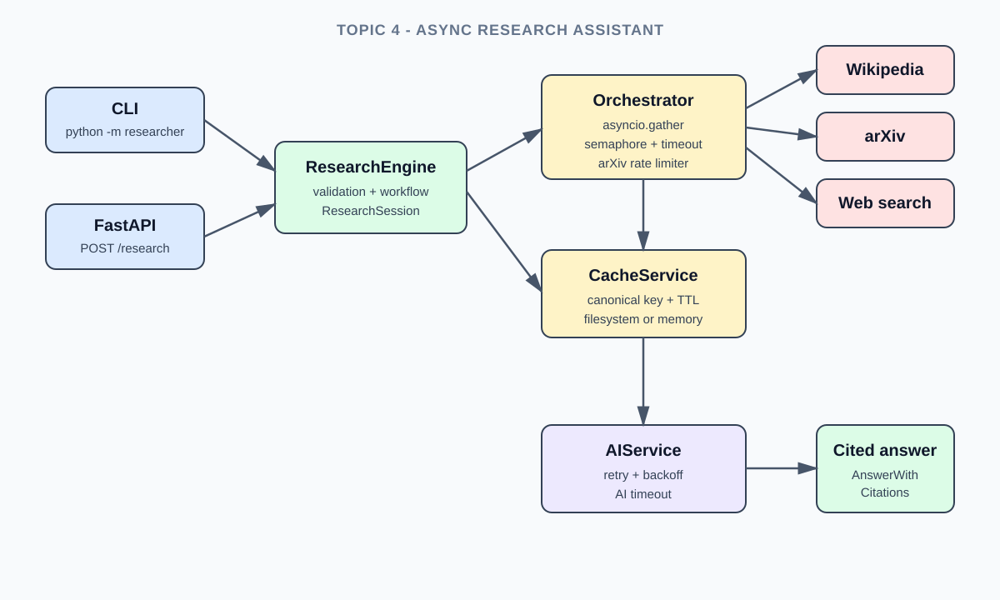
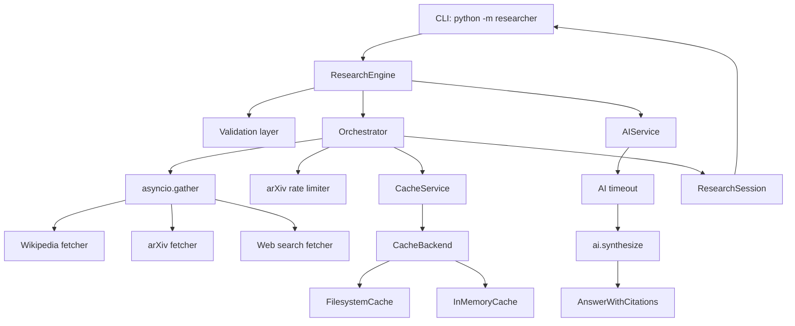

# Topic 4 Architecture

The application keeps the supplied `ai/` package unchanged and adds an engineering layer around it.

## Component diagram

Use this same `docs/architecture.svg` asset in the README, report, and slides so every deliverable shows one consistent architecture.

The arrows show the direction of a request. The three source boxes are independent concurrent tasks; a timeout or failure in one source does not cancel the others.

## Request flow

1. The CLI normalizes and validates the question and requested sources.
2. `ResearchEngine` asks `Orchestrator` for a `ResearchSession`.
3. The orchestrator starts enabled source fetchers with `asyncio.gather`, bounds work with a semaphore, applies one timeout to each source, and spaces arXiv requests according to `ARXIV_MIN_INTERVAL_SECONDS`.
4. `CacheService` canonicalizes `(source, query)` and delegates persistence to a backend. A failed or timed-out source returns an empty batch while other sources continue.
5. `AIService` calls the provided `ai.synthesize` function with the retrieved `Source` models and retries transient failures with exponential backoff. `ResearchEngine` bounds that synthesis call with `AI_TIMEOUT_SECONDS`.
6. The CLI renders the synthesized answer and only the citations actually used by the model.

The default Docker command uses the offline demo, so the image can be checked without API keys or live network calls. Live CLI research requires the selected LLM and web-search credentials in `.env`.
